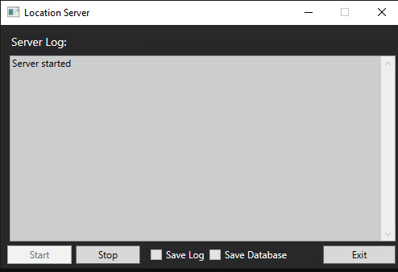

# TCP C# Server with UI
This project is based on my previous TCP server, but with an additional user interface.

#Usage
When launched with an argument of `–w`, it opens the user interface, otherwise launches as a console application.

